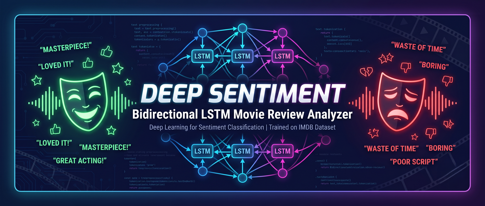

# 🎬 Deep Sentiment: Bidirectional LSTM Movie Review Analyzer

<p align="center">
  
</p>

An end-to-end **Natural Language Processing (NLP)** project that trains a **Bidirectional Long Short-Term Memory (BiLSTM)** neural network to classify movie reviews as **Positive** or **Negative**.

Built using **TensorFlow** and **Keras**, the model is trained on the **Stanford ACL IMDB Movie Review Dataset**, containing **50,000 labeled reviews**, and achieves approximately **85% test accuracy** on previously unseen data.


---

# 📌 Overview

Understanding human sentiment is one of the fundamental tasks in Natural Language Processing. This project demonstrates how **Bidirectional LSTMs** can capture contextual information from both directions of a sentence, allowing the model to better understand the emotional meaning behind movie reviews.

The project covers the complete NLP pipeline:

- Automated dataset acquisition
- Exploratory Data Analysis (EDA)
- Text preprocessing and tokenization
- Sequence padding
- Bidirectional LSTM model training
- Model evaluation
- Real-time sentiment prediction

---

# 🚀 Features

- 🎬 Binary sentiment classification (Positive / Negative)
- 📥 Automatic download of the Stanford ACL IMDB dataset
- 📊 Exploratory Data Analysis (EDA)
- 🧹 Text cleaning using Regular Expressions
- 🔤 Tokenization with a **10,000-word vocabulary**
- 📏 Sequence padding to **250 tokens**
- 🧠 Bidirectional LSTM architecture for improved contextual understanding
- 🛡️ Dropout regularization to reduce overfitting
- ⚡ GPU-accelerated TensorFlow training
- 💬 Interactive inference function for custom movie reviews

---

# 📂 Dataset

This project uses the **Stanford ACL IMDB Large Movie Review Dataset**.

### Dataset Statistics

| Property | Value |
|----------|-------|
| Reviews | 50,000 |
| Training Samples | 25,000 |
| Testing Samples | 25,000 |
| Classes | Positive, Negative |

Each review is labeled as:

| Label | Meaning |
|------:|---------|
| 0 | Negative |
| 1 | Positive |

---

# 🧠 Model Architecture

The model contains approximately **1.38 million trainable parameters**.

| Layer | Description |
|---------|-------------|
| Input | Integer sequence (250 tokens) |
| Embedding | 10,000 vocabulary → 128-dimensional embeddings |
| Bidirectional LSTM | 64 units |
| Dense | 64 neurons with ReLU activation |
| Dropout | 50% |
| Output | Sigmoid activation for binary classification |

### Training Configuration

| Parameter | Value |
|-----------|-------|
| Vocabulary Size | 10,000 |
| Maximum Sequence Length | 250 |
| Embedding Dimension | 128 |
| LSTM Units | 64 |
| Optimizer | Adam |
| Loss Function | Binary Crossentropy |
| Early Stopping | Yes |

---

# 📈 Results

The model was trained using **EarlyStopping**, monitoring validation loss to restore the best-performing weights.

### Test Performance

| Metric | Score |
|---------|------:|
| Test Accuracy | **~85%** |

The model successfully generalizes to unseen movie reviews while avoiding significant overfitting.

---

# 💬 Example Predictions

### Positive Review

```text
Review:
"This movie was an absolute masterpiece! The acting was phenomenal and the plot was gripping from start to finish."

Prediction:
Positive 🟢

Confidence:
82.63%
```

### Negative Review

```text
Review:
"Honestly, it was a massive waste of time. The script was terrible and I fell asleep halfway through."

Prediction:
Negative 🔴

Confidence:
99.94%
```

---

# 🛠️ Tech Stack

| Category | Technologies |
|-----------|--------------|
| Language | Python |
| Deep Learning | TensorFlow, Keras |
| Data Processing | Pandas, NumPy |
| Visualization | Matplotlib |
| Text Processing | Regular Expressions (Regex) |
| NLP | TensorFlow Tokenizer |

---

# 📁 Project Structure

```text
.
├── Deep_Sentiment_BiLSTM.ipynb
├── README.md
├── requirements.txt
└── (dataset downloaded automatically)
```

---

# 🚀 Getting Started

## 1. Clone the repository

```bash
git clone https://github.com/sanaurrehmanarain/deep-sentiment-bilstm.git

cd deep-sentiment-bilstm
```
---

## 2. Install dependencies

```bash
pip install -r requirements.txt
```

---

## 3. Open the notebook

Open

```text
Deep_Sentiment_BiLSTM.ipynb
```

using:

- Jupyter Notebook
- VS Code
- Google Colab

---

## 4. Train the model

Run all notebook cells from top to bottom.

The notebook will:

- Download the IMDB dataset
- Preprocess the text
- Train the BiLSTM model
- Evaluate performance
- Allow custom sentiment predictions

---

# 🔮 Future Improvements

- 🌐 Deploy using Streamlit
- 🤖 Compare BiLSTM with Transformer models (BERT)
- 📱 Create a REST API using FastAPI
- ☁️ Deploy to Hugging Face Spaces
- 🔍 Add attention mechanisms
- 📊 Visualize word embeddings

---

# 🏴‍☠️ Bonus: Known Bugs (Definitely Not Related to One Piece)

While extensive testing has been performed, the following "issues" are still under investigation:

### 🗺️ Zoro's Navigation Module

Occasionally predicts that every movie review is headed toward the **New World**.

No fix planned.

---

### 🍖 Luffy's Review Logic

If a review contains the words:

> meat, food, feast, banquet

the model may classify it as **Positive** regardless of the actual sentiment.

---

### ⚔️ Mihawk Mode

Extremely short reviews like:

> "Peak."

or

> "Cinema."

are treated as if they carry the weight of a thousand words.

---

### 🏴 Nico Robin Dependency

To fully understand hidden movie lore, you may require:

```python
NicoRobin.decode_void_century()
```

This package unfortunately remains unavailable on PyPI.

---

### 🌊 Devil Fruit Limitation

The model performs well on movie reviews but immediately loses all predictive power if submerged in seawater.

This behavior is considered canonical.

---

### 🧭 Zoro Still Can't Find the Correct Directory

If your notebook mysteriously opens the wrong folder...

It's probably Zoro.

---

# 🙏 Acknowledgements

This project makes use of:

- TensorFlow
- Keras
- Stanford ACL IMDB Dataset
- NumPy
- Pandas
- Matplotlib

Special thanks to the Straw Hat Pirates for absolutely no contribution to this project whatsoever.

---

## Citation

If you use this project in academic research, publications, educational
materials, or derivative works, please cite the project.

This repository includes a `CITATION.cff` file, so GitHub provides a
**"Cite this repository"** button in the repository sidebar. You can use it
to obtain citations in BibTeX, APA, and other supported formats.

**Suggested citation:**

Arain, S. U. R. (2026). deep-sentiment-bilstm (Version 1.0) [Software].
<https://github.com/sanaurrehmanarain/deep-sentiment-bilstm>

**Author:** Sana Ur Rehman Arain

**Profession:** Data Scientist

**GitHub:** <https://github.com/sanaurrehmanarain>

**Contact:** <sana.arain.work@gmail.com>

If you build upon this work, attribution is appreciated and helps others
discover the original project.

> **Note:** The MIT License requires that the original copyright
> notice be retained in copies of the Software.

---

## 📜 License

This project is licensed under the MIT License. See the
[LICENSE](LICENSE) file for details.

---

# ⭐ Support

If you enjoyed this project, consider giving it a **⭐ Star** on GitHub.

It helps others discover the project...

...and might help Zoro discover the correct repository someday.